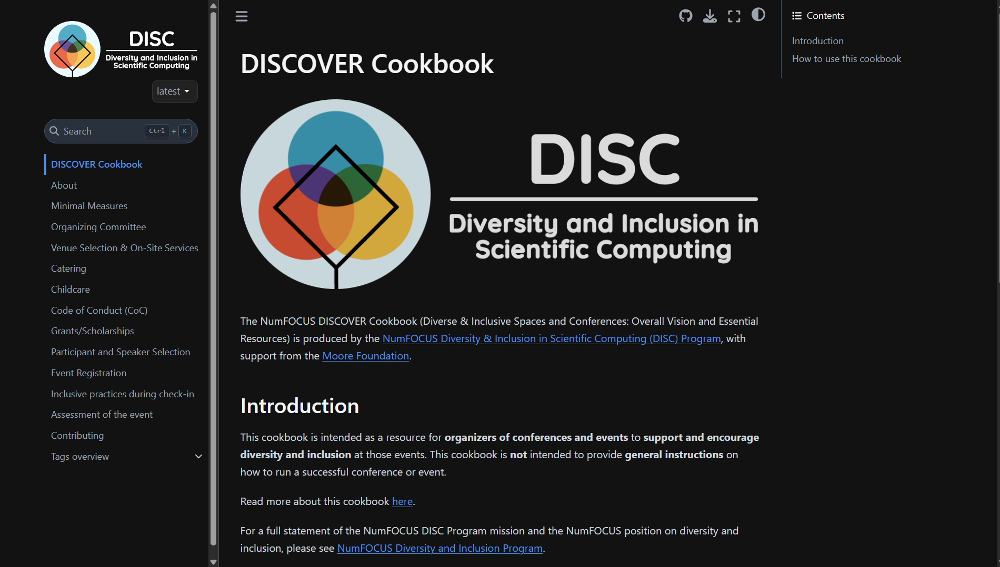
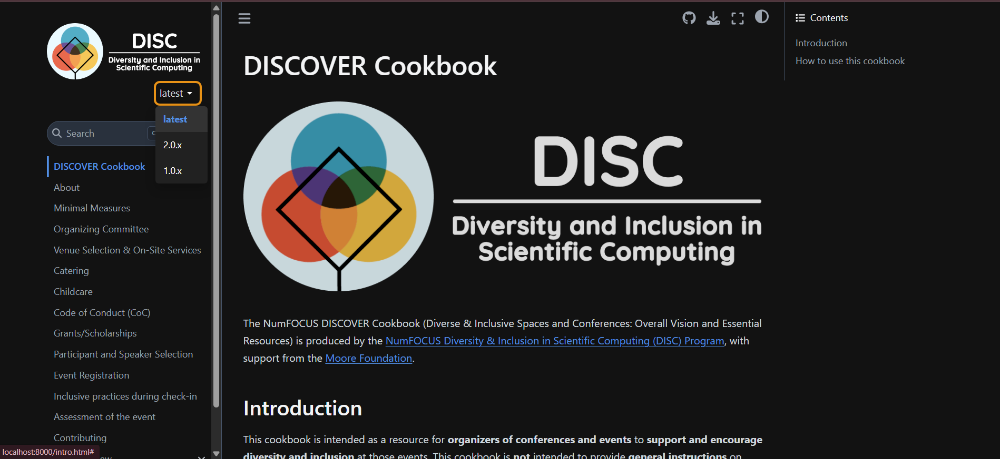

# Proposal : Tag-Based Version Management System for DISCOVER Cookbook

## Abstract

This proposal outlines an implementation strategy for a tag-based version management system for the DISCOVER Cookbook following standard documentation versioning practices. The implementation will enable users to seamlessly navigate between different cookbook editions through a simple version selector integrated with the existing Jupyter Book interface, while maintaining the current GitHub Pages infrastructure.

## Detailed description

### Current Architecture Analysis

The DISCOVER Cookbook currently has no formal versioning system:

- Current version is in the main branch, deployed at https://discover-cookbook.numfocus.org

This structure creates several critical challenges:

1. **Hidden Versions**: Users can't tell which version they're viewing or that other versions exist, so they might miss updated recommendations.

2. **Hard to Navigate**: Switching between versions requires typing different URLs or navigating through GitHub, making for a poor user experience.

3. **Content Evolution Opacity**: Users can't easily see how DEI recommendations have changed over time.

### Solution Architecture

My implementation will use a tag-based versioning approach :

1. **Tag-Based Version Management:**:
   - Maintain a single active branch (main)
   - Use Git tags to mark specific numeric versions (1.0, 2.0, etc.)
   - Main branch will be labeled as "2.0-dev" (or current version + "-dev")
   - Consider integrating versioneer to display which version is being rendered
   - Deploy each tagged version to its corresponding URL path

2. **URL Structure**:
   - Latest development version: discover-cookbook.numfocus.org/ (main branch as 2.0-dev)
   - Released versions: discover-cookbook.numfocus.org/v1.0/, discover-cookbook.numfocus.org/v2.0/
   - Version-specific pages: discover-cookbook.numfocus.org/v1.0/04_venue_selection/
   - Implement redirects from root paths to appropriate versioned paths (e.g., discover-cookbook.numfocus.org/05_venue_selection/ → discover-cookbook.numfocus.org/v1.0/05_venue_selection/)

3. **Development Environment**:
   - Create separate scripts for local development and deployment
   - Ensure contributors can iterate on content locally without versioning complexity
   - Local preview will default to development version
   
4. **Version UI Components**:
   - Simple version selector in an appropriate location within the existing UI
   - Outdated version notification for non-latest versions(via banner at top)

### User Benefits

This implementation delivers significant user experience improvements:

1. **Clear Version Context**: Users immediately know which version they're viewing and what other versions exist.

2. **Accessible Navigation**: Simple method for switching between versions.

3. **Historical Transparency**: Easy access to how DEI recommendations have evolved over time.

### User Scenarios

**Scenario 1: Conference Organizer - Version Comparison**
Sunita is organizing a conference and needs to compare current and previous recommendations:

- She visits discover-cookbook.numfocus.org and sees she's viewing v2.0
- She notices the version selector in the navigation
- She clicks to view v1.0 while viewing the "venue selection" section
- The system navigates her to the equivalent section in v1.0
- She can easily toggle between versions to compare approaches
  

  

**Scenario 2: First-time Visitor - Version Awareness**
Karan discovers the cookbook through social media:

- He lands on discover-cookbook.numfocus.org (latest version)
- The version indicator shows he's viewing the current version (v2.0)
- He's aware previous versions exist through the version selector
- If he follows an old link to v1.0, he'll see a banner indicating newer content exists

## Implementation

My implementation follows a systematic approach that respects the current project architecture:

### 0. Design Phase
I will first create detailed design documentation that includes:

- Tag-based versioning schema
- UI mockups for version selection (minimal changes to existing design)
- Deployment architecture

### 1. Tag-Based Version Structure

I will implement a approach that:

- Uses Git tags to mark specific versions
- Creates a simple mapping file to track tagged versions
- Requires minimal infrastructure changes

### 2. Enhanced GitHub Actions Workflow

I will configure the GitHub Actions workflow to:

- Build and deploy tagged versions to their respective directories
- Maintain the main branch deployment at the root path
- Preserve the CNAME file for the custom domain
### 3. Version Selector UI Component

I will implement an accessible, user-friendly version selector component:

- Integrates with the existing Jupyter Book UI
- Provides a clear indicator of the current version
- Offers a simple method to switch to other versions

  

  

### 4. Outdated Version Notification Banner

For non-latest versions, I will implement a notification banner:

- Subtle indicator that appears in an unobtrusive location
- Brief message indicating a newer version exists
- Link to the equivalent page in the latest version
- Designed to complement the existing UI without disrupting the user experience

This banner ensures users are immediately aware when viewing outdated content while providing a direct path to the latest version.

### 5. Cross-Version Navigation System

I will develop a simple navigation system between versions:

- Maps common pages across versions
- Falls back to the main page when direct equivalents aren't available
- Uses a straightforward URL-based approach

### 6. Integration with Jupyter Book

I will make minimal changes to the Jupyter Book configuration to:

- Load version management components
- Integrate with the existing theme
- Preserve current customizations
- Support the version selector UI

This will involve updating the _config.yml file to include the necessary JavaScript and CSS files while maintaining compatibility with the existing configuration.

### 7. Implementation Dependencies

- **Step 0** (Signed-Off Design) defines the versioning plan using Git tags
- **Step 1** (Version Architecture) is foundational and must be implemented first
- **Step 2** (GitHub Actions Workflow) can be developed in parallel with Step 1
- **Steps 3-4** (UI Components) depend on Step 1
- **Step 5** (Cross-Version Navigation) depends on Steps 1-3
- **Step 6** (Jupyter Book Integration) integrates all previous components

### Implementation Timeline

**Phase 1: Foundation & Infrastructure (Weeks 1-3)**
- Develop version data architecture
- Configure GitHub Actions workflow
- Create initial deployment tests

**Phase 2: Core UI Development (Weeks 4-6)**
- Implement version selector component
- Create outdated version notification banner
- Develop basic cross-version navigation

**Phase 3: Testing & Refinement (Weeks 7-9)**
- Enhance cross-version navigation
- Implement special case handling
- Conduct cross-browser testing
- Verify accessibility compliance

**Phase 4: Refinement & Documentation (Weeks 10-12)**
- Optimize performance
- Refine responsive behavior
- Create technical documentation
- Prepare user guides

## Websites following a similar approach
- https://pandas.pydata.org/docs/
- https://scikit-learn.org/stable/  
- https://matplotlib.org/stable/  

## Alternative Approach

I've evaluated several alternative approaches based on thorough analysis of documentation versioning systems, I came to the conclusion that these two approaches are best according to industry standards with minimal changes in repository structure:

### Read the Docs Migration

**Approach**: Migrate from GitHub Pages to Read the Docs platform.

**Advantages**:
- Built-in versioning system
- Established version selector UI

**Disadvantages**:
- Requires significant migration effort
- Disrupts existing deployment workflow
- Requires adapting Jupyter Book configuration for RTD
- Changes contributor workflow
- This also requires a paid account to run ad free
- Depends on a more complex service than just hosting static webpages, which can be done on a multitude of services.

## Websites following a similar approach  
- https://jupyter-sphinx.readthedocs.io/en/latest/setup.html 
- https://flask.palletsprojects.com/en/stable/  
- https://docs.momepy.org/en/stable/

