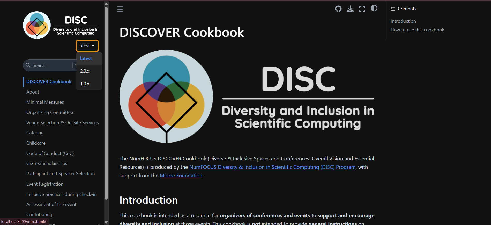

# Proposal : Branch-Based Version Management System for DISCOVER Cookbook

## Abstract

This proposal outlines a comprehensive implementation strategy for a branch-based version management system for the DISCOVER Cookbook following industry-standard documentation versioning practices as used by scikit-learn, Matplotlib, NetworkX, and other NumFOCUS projects. The implementation will enable users to seamlessly navigate between different cookbook editions (v2.0/main and v1.0/master) through a version selector integrated with the existing Jupyter Book interface, while maintaining the current GitHub Pages infrastructure.

## Detailed description

### Current Architecture Analysis

The DISCOVER Cookbook currently maintains two separate versions with no navigation between them:

- Current version (v2.0) in the main branch, deployed at https://discover-cookbook.numfocus.org
- Previous version (v1.0) in the master branch, deployed at https://discover-cookbook.github.io/

This structure creates several critical challenges:

1. **Hidden Versions**: Users can't tell which version they're viewing or that other versions exist, so they might miss updated recommendations.

2. **Hard to Navigate**: Switching between versions requires typing different URLs or navigating through GitHub, making for a poor user experience.

3. **Content Evolution Opacity**: Users can't easily see how DEI recommendations have changed over time.

### Solution Architecture

My implementation follows the industry-standard branch-based versioning model used by scikit-learn, Matplotlib, NetworkX, and other NumFOCUS projects:

1. **Branch-Version Mapping**:
   - main branch (v2.0) → deployed to / (root path)
   - master branch (v1.0) → deployed to /v1.0/
   - future version branches → deployed to /v{X.Y}/

2. **URL Structure**:
   - Latest version: discover-cookbook.numfocus.org/
   - Previous version: discover-cookbook.numfocus.org/v1.0/
   - Version-specific pages: discover-cookbook.numfocus.org/v1.0/04_venue_selection/

3. **Version UI Components**:
   - Version dropdown menu in the left sidebar.
   - Clear current version indicator
   - Outdated version notification for non-latest versions(via banner at top)
   - Context-preserving navigation between versions

### User Benefits

This implementation delivers significant user experience improvements:

1. **Clear Version Context**: Users immediately know which version they're viewing and what other versions exist.

2. **Seamless Navigation**: One-click switching between versions preserves topic context when possible.

3. **Historical Transparency**: Easy access to how DEI recommendations have evolved over time.

### User Scenarios

**Scenario 1: Conference Organizer - Version Comparison**
Sunita is organizing a conference and needs to compare current and previous recommendations:

- She visits discover-cookbook.numfocus.org and sees she's viewing v2.0
- She notices the version selector in the navigation
- She clicks to view v1.0 while viewing the "venue selection" section
- The system navigates her to the equivalent section in v1.0
- She can easily toggle between versions to compare approaches
  

  

**Scenario 2: First-time Visitor - Version Awareness**
Karan discovers the cookbook through social media:

- He lands on discover-cookbook.numfocus.org (latest version)
- The version indicator shows he's viewing the current version (v2.0)
- He's aware previous versions exist through the version selector
- If he follows an old link to v1.0, he'll see a banner indicating newer content exists

## Implementation

My implementation follows a systematic approach aligned with industry standards for documentation versioning:

### 1. Version Data Architecture

I will implement a centralized version registry that defines all versions and their relationships. This architecture will:
- Provide a single source of truth for version information
- Support automatic version detection from URL paths
- Enable contextual navigation between versions
- Scale to accommodate future versions
- Maintain independence between versions

The version data structure will include:
- Version metadata (name, display name, URL path, branch, release date, status)
- Utility functions for version detection and navigation
- Mapping data for equivalent content across versions

### 2. Enhanced GitHub Actions Workflow

I will configure an improved deployment workflow by enhancing the existing GitHub Actions setup to:
- Automatically detect the source branch
- Map branches to appropriate URL paths
- Apply version-specific configurations
- Deploy to the correct subfolder in gh-pages
- Preserve the CNAME file for the custom domain

The workflow will determine the target path based on the branch (main → /, master → /v1.0/) and deploy each version to its dedicated location while maintaining the shared domain.

### 3. Version Selector UI Component

I will implement an accessible, user-friendly version selector component:

1. **Component Location**: Integrated into the Jupyter Book in the left sidebar
2. **Implementation Strategy**:
   - DOM-based insertion for compatibility with Jupyter Book
   - Event-driven interaction handling
   
3. **UI Features**:
   - Current version indicator
   - Dropdown for all available versions
   - Version-specific metadata (status)
   - Visual distinction for latest version

4. **Responsive Design**:
   - Adapts to all screen sizes
   - Maintains usability on mobile devices
   - Follows existing responsive breakpoints
  

  
### 4. Outdated Version Notification Banner

For non-latest versions (v1.0), I will implement a prominent notification banner:

1. **Banner Design**:
   - Full-width banner at the top of the page
   - Distinct background color for visibility (red or any color of your choice)
   - Clear typography with sufficient contrast
   - Non-disruptive but immediately noticeable

2. **Banner Content**:
   - Clear message: "You are viewing an older version (v1.0) of the DISCOVER Cookbook"
   - Direct link to equivalent page in latest version
   - Release date information to provide context

3. **Technical Implementation**:
   - Conditional insertion based on version detection
   - Responsive design for all screen sizes
   - Persistent across page navigation within same version

This banner ensures users are immediately aware when viewing outdated content while providing a direct path to the latest version.

### 5. Cross-Version Navigation System

I will develop intuitive navigation between versions:

1. **Path Mapping Algorithm**:
   - Maps equivalent content across versions
   - Handles renamed or restructured pages
   - Provides graceful fallbacks when content differs

2. **Implementation Strategy**:
   - URL path normalization
   - Content structure analysis
   - Special case handling for moved content

### 6. Integration with Jupyter Book

I will extend the existing Jupyter Book configuration to:
- Load version management components
- Integrate with the existing theme
- Preserve current customizations
- Support the version selector UI

This will involve updating the _config.yml file to include the necessary JavaScript and CSS files while maintaining compatibility with the existing configuration.

### 7. Implementation Dependencies

- **Step 1** (Version Architecture) is foundational and must be implemented first
- **Step 2** (GitHub Actions Workflow) can be developed in parallel with Step 1
- **Steps 3-4** (UI Components) depend on Step 1
- **Step 5** (Cross-Version Navigation) depends on Steps 1-3
- **Step 6** (Jupyter Book Integration) integrates all previous components

### 8. Implementation Timeline

**Phase 1: Foundation & Infrastructure (Weeks 1-3)**
- Develop version data architecture
- Configure GitHub Actions workflow
- Create initial deployment tests

**Phase 2: Core UI Development (Weeks 4-6)**
- Implement version selector component
- Create outdated version notification banner
- Develop basic cross-version navigation

**Phase 3: Advanced Features & Testing (Weeks 7-9)**
- Enhance cross-version navigation
- Implement special case handling
- Conduct cross-browser testing
- Verify accessibility compliance

**Phase 4: Refinement & Documentation (Weeks 10-12)**
- Optimize performance
- Refine responsive behavior
- Create technical documentation
- Prepare user guides

## Websites following a similar approach
- https://scikit-learn.org/stable/  
- https://matplotlib.org/stable/  
- https://networkx.org/documentation/latest/

## Alternative Approach

I've evaluated several alternative approaches based on thorough analysis of documentation versioning systems, I came to the conclusion that these two approaches are best according to industry standards with minimal changes in repository structure:

### Read the Docs Migration

**Approach**: Migrate from GitHub Pages to Read the Docs platform.

**Advantages**:
- Built-in versioning system
- Established version selector UI

**Disadvantages**:
- Requires significant migration effort
- Disrupts existing deployment workflow
- Requires adapting Jupyter Book configuration for RTD
- Changes contributor workflow

## Websites following a similar approach  
- https://jupyter-sphinx.readthedocs.io/en/latest/setup.html 
- https://flask.palletsprojects.com/en/stable/  
- https://docs.momepy.org/en/stable/

